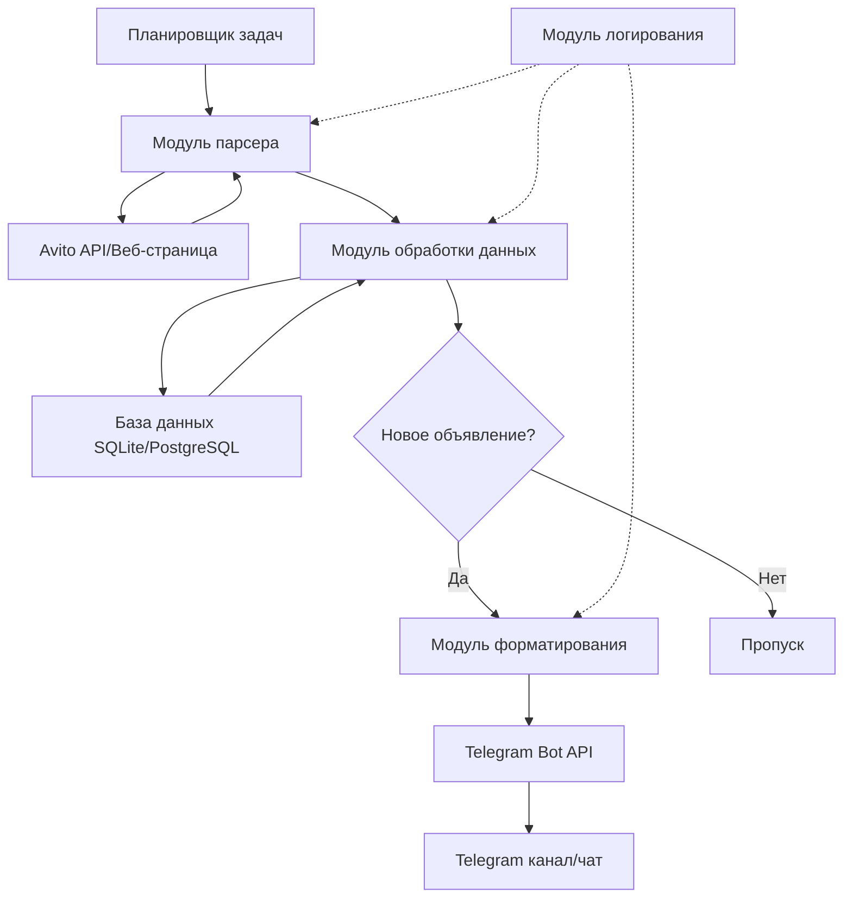

# План реализации парсера объявлений Avito с отправкой в Telegram

## Обзор проекта

Парсер для мониторинга новых объявлений в категории "Техника" на Avito.ru с автоматической отправкой уведомлений в Telegram-канал/чат.

## Технические требования

### Функциональные требования
- Парсинг всех объявлений в категории "Техника" на Avito
- Охват всех регионов России
- Отслеживание только новых (ранее не обработанных) объявлений
- Отправка уведомлений в Telegram
- Настраиваемый интервал проверки
- Работа в фоновом режиме 24/7

### Нефункциональные требования
- Надежность и стабильность работы
- Обработка ошибок и восстановление после сбоев
- Логирование всех операций
- Минимальная нагрузка на целевой сайт
- Обход антибот-защиты (если потребуется)

## Выбор технологического стека

### Рекомендуемый стек: Python

**Обоснование выбора Python:**
- Богатая экосистема библиотек для парсинга (BeautifulSoup, Selenium, Scrapy)
- Простая работа с Telegram Bot API через aiogram/python-telegram-bot
- Легкость настройки планировщиков задач (APScheduler)
- Хорошая поддержка работы с БД (SQLite, PostgreSQL)
- Быстрая разработка и отладка
- Низкий порог входа для поддержки кода

### Основные библиотеки

```
- requests / httpx - HTTP-запросы
- beautifulsoup4 - парсинг HTML
- selenium / playwright - для динамического контента (если нужно)
- python-telegram-bot / aiogram - интеграция с Telegram
- SQLAlchemy - ORM для работы с БД
- APScheduler - планировщик задач
- python-dotenv - управление конфигурацией
- loguru - продвинутое логирование
```

## Архитектура системы



## Структура проекта

```
avito-parser/
├── src/
│   ├── __init__.py
│   ├── config.py              # Конфигурация проекта
│   ├── parser/
│   │   ├── __init__.py
│   │   ├── avito_parser.py    # Основной модуль парсинга
│   │   └── helpers.py         # Вспомогательные функции
│   ├── database/
│   │   ├── __init__.py
│   │   ├── models.py          # Модели БД
│   │   └── repository.py      # Работа с БД
│   ├── telegram/
│   │   ├── __init__.py
│   │   ├── bot.py             # Telegram бот
│   │   └── formatter.py       # Форматирование сообщений
│   ├── scheduler/
│   │   ├── __init__.py
│   │   └── jobs.py            # Задачи планировщика
│   └── utils/
│       ├── __init__.py
│       ├── logger.py          # Настройка логирования
│       └── exceptions.py      # Пользовательские исключения
├── tests/
│   ├── __init__.py
│   ├── test_parser.py
│   ├── test_database.py
│   └── test_telegram.py
├── logs/                      # Директория для логов
├── data/                      # Директория для БД
├── .env.example               # Пример файла конфигурации
├── .gitignore
├── requirements.txt           # Зависимости Python
├── README.md                  # Документация
└── main.py                    # Точка входа приложения
```

## Детальный план реализации

### Этап 1: Исследование и подготовка

#### 1.1 Исследовать структуру Avito
- Проанализировать HTML-структуру страниц категории "Техника"
- Проверить наличие официального API
- Изучить возможность использования RSS-лент
- Определить селекторы для извлечения данных
- Проверить наличие антибот-защиты (Cloudflare, reCAPTCHA и т.д.)
- Определить структуру URL для разных регионов

#### 1.2 Определить метод парсинга
**Варианты:**
- **Официальный API** (предпочтительно, если доступен)
- **RSS-ленты** (если предоставляются Avito)
- **Веб-скрейпинг** с помощью requests + BeautifulSoup (для статического контента)
- **Selenium/Playwright** (если контент загружается динамически через JavaScript)

**Рекомендация:** Начать с исследования официального API и RSS, затем веб-скрейпинг как резервный вариант.

### Этап 2: Настройка окружения

#### 2.1 Создать структуру проекта
- Создать директории согласно структуре выше
- Инициализировать виртуальное окружение Python
- Создать файл requirements.txt
- Настроить .gitignore для Python-проектов

#### 2.2 Создать файл конфигурации
Создать .env.example с параметрами:
```
TELEGRAM_BOT_TOKEN=your_bot_token_here
TELEGRAM_CHAT_ID=your_chat_id_here
PARSER_INTERVAL_MINUTES=15
DATABASE_URL=sqlite:///data/avito_parser.db
LOG_LEVEL=INFO
AVITO_REGIONS=all
```

### Этап 3: Реализация модуля парсинга

#### 3.1 Создать модуль avito_parser.py

**Основные компоненты:**
```python
class AvitoParser:
    def __init__(self, config):
        # Инициализация парсера
        
    def get_listings(self, region=None):
        # Получение списка объявлений
        
    def parse_listing_details(self, listing_url):
        # Извлечение детальной информации об объявлении
        
    def extract_listing_data(self, html):
        # Парсинг HTML и извлечение данных
```

**Данные для извлечения:**
- ID объявления (уникальный идентификатор)
- Заголовок
- Цена
- Описание
- URL объявления
- URL изображений
- Дата публикации
- Местоположение (город, регион)
- Категория/подкатегория
- Контактная информация (если доступна)

#### 3.2 Добавить обработку ошибок
- Обработка HTTP-ошибок (404, 500, timeout)
- Обработка изменений в структуре HTML
- Retry-механизм для неудачных запросов
- Rate limiting для предотвращения блокировки

#### 3.3 Реализовать обход антибот-защиты (при необходимости)
- Использование случайных User-Agent
- Добавление задержек между запросами
- Использование прокси (опционально)
- Эмуляция реального браузера с помощью Selenium/Playwright

### Этап 4: Реализация работы с базой данных

#### 4.1 Создать модели данных в models.py

```python
class Listing:
    id: int (Primary Key)
    avito_id: str (Unique)
    title: str
    price: decimal
    description: text
    url: str
    image_urls: json
    published_at: datetime
    location: str
    category: str
    is_sent: bool
    created_at: datetime
    updated_at: datetime
```

#### 4.2 Создать репозиторий в repository.py

**Основные методы:**
```python
class ListingRepository:
    def get_by_avito_id(self, avito_id) -> Listing
    def is_new_listing(self, avito_id) -> bool
    def save_listing(self, listing) -> Listing
    def mark_as_sent(self, listing_id) -> bool
    def get_unsent_listings() -> List[Listing]
```

#### 4.3 Выбор БД
- **SQLite** - для простого развертывания на одной машине
- **PostgreSQL** - для более серьезного продакшена с высокой нагрузкой

### Этап 5: Интеграция с Telegram

#### 5.1 Создать Telegram бота
- Зарегистрировать бота через @BotFather
- Получить токен бота
- Определить chat_id канала/группы для отправки

#### 5.2 Реализовать модуль bot.py

```python
class TelegramNotifier:
    def __init__(self, token, chat_id):
        # Инициализация бота
        
    def send_listing(self, listing_data):
        # Отправка объявления
        
    def send_message(self, text):
        # Отправка текстового сообщения
        
    def send_photo_with_caption(self, photo_url, caption):
        # Отправка фото с описанием
```

#### 5.3 Создать форматтер сообщений в formatter.py

**Формат сообщения:**
```
🔔 Новое объявление: {title}

💰 Цена: {price}
📍 Местоположение: {location}
📅 Опубликовано: {published_at}

📝 Описание:
{description}

🔗 Ссылка: {url}
```

**Дополнительные возможности:**
- Отправка изображений (первое фото из объявления)
- Inline-кнопки для быстрого перехода на Avito
- Группировка объявлений (медиа-группа для нескольких фото)

### Этап 6: Реализация планировщика

#### 6.1 Создать модуль jobs.py

```python
def parse_and_notify_job():
    # Основная задача: парсинг + отправка уведомлений
    parser = AvitoParser()
    listings = parser.get_listings()
    
    for listing in listings:
        if repository.is_new_listing(listing.avito_id):
            repository.save_listing(listing)
            telegram_bot.send_listing(listing)
```

#### 6.2 Настроить APScheduler в main.py

```python
from apscheduler.schedulers.blocking import BlockingScheduler

scheduler = BlockingScheduler()
scheduler.add_job(
    parse_and_notify_job,
    'interval',
    minutes=config.PARSER_INTERVAL_MINUTES
)
scheduler.start()
```

### Этап 7: Конфигурация и логирование

#### 7.1 Создать модуль конфигурации config.py
- Загрузка переменных из .env
- Валидация конфигурации
- Настройки по умолчанию

#### 7.2 Настроить логирование в logger.py
- Логирование в файл и консоль
- Ротация логов
- Разные уровни логирования (DEBUG, INFO, WARNING, ERROR)
- Структурированные логи

### Этап 8: Тестирование

#### 8.1 Модульные тесты
- Тесты парсера (с мокированием HTTP-запросов)
- Тесты работы с БД
- Тесты форматирования сообщений

#### 8.2 Интеграционные тесты
- Тест полного цикла: парсинг → БД → Telegram
- Тест обработки ошибок
- Тест планировщика

#### 8.3 Ручное тестирование
- Запуск на реальных данных
- Проверка корректности парсинга
- Проверка доставки сообщений в Telegram
- Мониторинг производительности

### Этап 9: Документация и развертывание

#### 9.1 Создать README.md
**Содержание:**
- Описание проекта
- Требования к системе
- Инструкция по установке
- Настройка конфигурации
- Запуск приложения
- Возможные проблемы и их решение
- FAQ

#### 9.2 Подготовить развертывание
**Варианты развертывания:**
- Локальный сервер (Windows/Linux)
- VPS (DigitalOcean, AWS EC2, Hetzner)
- Docker-контейнер
- Heroku / Railway / Render

**Systemd service (для Linux):**
```ini
[Unit]
Description=Avito Parser Service
After=network.target

[Service]
Type=simple
User=parser
WorkingDirectory=/path/to/avito-parser
ExecStart=/path/to/venv/bin/python main.py
Restart=always

[Install]
WantedBy=multi-user.target
```

#### 9.3 Подготовить Docker (опционально)
Создать Dockerfile и docker-compose.yml для удобного развертывания.

## Дополнительные возможности (опционально)

### Фильтрация объявлений
- Фильтр по цене (мин/макс)
- Фильтр по ключевым словам в заголовке
- Фильтр по регионам
- Фильтр по подкатегориям техники

### Админ-панель бота
- Команды для управления парсером (`/start`, `/stop`, `/status`)
- Изменение интервала парсинга через Telegram
- Статистика (количество обработанных объявлений)

### Уведомления о проблемах
- Отправка в Telegram сообщений об ошибках парсера
- Мониторинг работоспособности

### Аналитика
- Сбор статистики по ценам
- Графики изменения количества объявлений
- Экспорт данных в CSV/Excel

## Возможные проблемы и решения

### Проблема 1: Антибот-защита Avito
**Решение:**
- Использование Selenium с реальным браузером
- Rotating proxies
- Случайные задержки между запросами
- Обновление User-Agent

### Проблема 2: Изменение структуры HTML
**Решение:**
- Гибкие селекторы
- Регулярное обновление парсера
- Логирование неудачных парсингов для быстрого обнаружения

### Проблема 3: Большой объем объявлений
**Решение:**
- Пагинация при парсинге
- Ограничение на количество объявлений за один запуск
- Оптимизация запросов к БД

### Проблема 4: Блокировка Telegram Bot API
**Решение:**
- Соблюдение лимитов API (не более 30 сообщений в секунду)
- Throttling для отправки сообщений
- Группировка нескольких объявлений в одно сообщение

## Оценка сложности задач

- **Исследование Avito** - средняя сложность
- **Парсинг данных** - средняя-высокая сложность (зависит от антибот-защиты)
- **Работа с БД** - низкая сложность
- **Интеграция с Telegram** - низкая сложность
- **Планировщик задач** - низкая сложность
- **Обработка ошибок и логирование** - средняя сложность
- **Тестирование** - средняя сложность
- **Развертывание** - низкая-средняя сложность

## Рекомендации по реализации

1. **Начните с MVP** - реализуйте базовую функциональность (парсинг + отправка в Telegram)
2. **Тестируйте на небольшом объеме** - начните с одного региона или подкатегории
3. **Постепенное масштабирование** - после успешного тестирования расширяйте охват
4. **Мониторинг с первого дня** - настройте логирование и уведомления об ошибках
5. **Документируйте код** - это упростит поддержку и доработку
6. **Резервное копирование БД** - настройте автоматическое создание бэкапов

## Заключение

Данный план предоставляет полное руководство по реализации парсера объявлений Avito с интеграцией Telegram. Проект можно реализовать за несколько итераций, постепенно добавляя функциональность и улучшая надежность системы.
